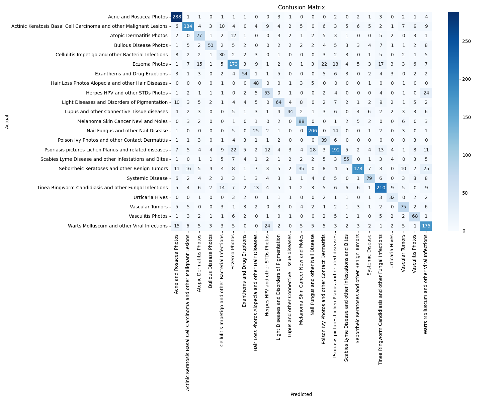

# 🏥 AI Dermatology Project: End-to-End Classification Pipeline

[](https://github.com/youssefjedidi/AI-Dermatology-Project/actions/workflows/main.yml)
[](https://github.com/youssefjedidi/AI-Dermatology-Project)
[](https://www.python.org/downloads/)
[](https://opensource.org/licenses/Apache-2.0)

A production-ready, end-to-end deep learning pipeline for classifying 23 dermatological conditions from images. This project demonstrates a complete MLOps workflow, from automated data ingestion and preprocessing to a sophisticated two-stage training strategy, deployment-focused optimization, and rigorous automated testing.


_Confusion matrix of the final model's performance on the unseen test set._

---

## 🚀 Key Features

- **Modular, Reproducible Pipeline**: The entire workflow is orchestrated by a single `main.py` script for perfect reproducibility.
- **Automated Data Ingestion**: Seamlessly downloads and prepares the DermNet dataset from Kaggle using the official API.
- **Advanced Training Strategy**: Implements a two-stage transfer learning process with a pre-trained Xception model:
  1.  **Feature Extraction**: Trains a custom classification head on top of a frozen base model.
  2.  **Fine-Tuning**: Unfreezes the top layers of the base model and trains end-to-end with a low learning rate for maximum performance.
- **Deployment Optimization**: The final model is quantized using TensorFlow Lite, achieving a significant model size reduction for efficient edge deployment.
- **Comprehensive Testing**: The codebase is validated by a robust suite of unit tests using `pytest`, achieving **90% code coverage**.
- **Automated CI/CD**: A GitHub Actions workflow automatically lints and runs all tests on every push, ensuring code reliability and preventing regressions.

## 📋 Table of Contents

- [Project Structure](#-project-structure)
- [Setup and Installation](#-setup-and-installation)
- [Usage](#-usage)
- [Model Architecture & Training](#-model-architecture--training)
- [Performance & Results](#-performance--results)
- [Testing](#-testing)
- [Future Roadmap](#-future-roadmap)
- [License](#-license)
- [Contact](#-contact)

## 🏗️ Project Structure

The project is organized with a clean, modular architecture to separate concerns and promote best practices.

```
AI-Dermatology-Project/
├── .github/workflows/
│   └── main.yml               # CI/CD pipeline definition for GitHub Actions
├── logs/                        # (Git-ignored) Stores training logs and output graphs
├── models/                      # (Git-ignored) Stores trained model files
├── data/                        # (Git-ignored) Stores the downloaded DermNet dataset
├── src/
│   ├── config.py              # Central configuration for all pipeline parameters
│   ├── data_ingestion.py      # Handles Kaggle API download and extraction
│   ├── data_preprocessing.py  # Creates TF Data generators, augments, and preprocesses
│   ├── model.py               # Defines the Xception model architecture
│   ├── train.py               # Manages the model training, callbacks, and saving
│   ├── evaluate.py            # Evaluates a trained model on the test set
│   ├── quantization.py        # Converts the final model to TFLite and evaluates it
│   └── predict.py             # Script for making predictions on single images
├── tests/
│   ├── test_data_ingestion.py
│   └── ...                    # All other unit test files
├── main.py                      # Main entry point to run the full end-to-end pipeline
├── requirements.txt             # Project dependencies
├── pytest.ini                   # Pytest configuration
├── LICENSE                      # Project license (MIT)
└── README.md                    # This file
```

## 🛠️ Setup and Installation

### Prerequisites

- Python 3.9+
- A Kaggle Account and API Token

### Steps

1.  **Clone the Repository**

    ```bash
    git clone https://github.com/youssefjedidi/AI-Dermatology-Project.git
    cd AI-Dermatology-Project
    ```

2.  **Create and Activate a Virtual Environment**

    ```bash
    # Remove any existing venv if it's corrupted
    rm -rf venv
    
    python3 -m venv venv
    source venv/bin/activate  # On Windows use `venv\Scripts\activate`
    ```

3.  **Install Dependencies**

    ```bash
    pip install -r requirements.txt
    # For Apple Silicon (M1/M2/M3/M4) GPU acceleration, uncomment last lines in requirement.txt
    ```

4.  **Set Up Kaggle API Credentials**
    - Go to your Kaggle account settings (`https://www.kaggle.com/me/account`) and click "Create New Token" to download `kaggle.json`.
    - Place the downloaded `kaggle.json` file in the **root directory** of this project.

## 🎯 Usage

The pipeline is designed to be run from the root directory.

### 1. Run the Full End-to-End Pipeline

This single command will perform data download, initial training, and fine-tuning.

```bash
python main.py
```

_(Note: This can take a significant amount of time to complete, even on a GPU.)_

### 2. Run Individual Pipeline Stages

You can also run the key stages of the pipeline independently, assuming the previous stages have been completed.

- **Evaluate the final trained model:**
  _(Requires a `.weights.h5` file in the `models/` directory)_

  ```bash
  PYTHONPATH="$(pwd):$PYTHONPATH" python src/evaluate.py
  ```

- **Quantize the final model to TFLite:**
  _(Requires a `.weights.h5` file in the `models/` directory)_
  ```bash
  PYTHONPATH="$(pwd):$PYTHONPATH" python src/quantization.py
  ```
- **Predict a single image:**
  _(Requires a `.tflite` file in the `models/` directory)_
  ```bash
  PYTHONPATH="$(pwd):$PYTHONPATH" python src/predict.py
  ```
  _(Note: You must edit the `image_to_predict` variable inside the file.)_

## 🧠 Model Architecture & Training

The project leverages a powerful two-stage transfer learning strategy to maximize performance.

- **Base Model**: **Xception**, pre-trained on ImageNet.
- **Custom Head**: A `GlobalAveragePooling2D` layer followed by a `Dense` layer with 512 units, `Dropout` for regularization, and a final `Dense` classification layer with `softmax` activation.

#### Training Strategy:

1.  **Feature Extraction**: The Xception base is frozen, and only the custom classification head is trained with a higher learning rate (`0.001`). This allows the model to quickly learn to classify skin conditions using the general features from ImageNet.
2.  **Fine-Tuning**: The top 35 layers of the Xception base are unfrozen, and the entire model is trained at a very low learning rate (`0.00005`). This allows the model to subtly adapt its feature extraction capabilities specifically for dermatological images.
3.  **Callbacks**: The training process is monitored by `EarlyStopping` to prevent overfitting, `ReduceLROnPlateau` to adjust the learning rate, and `ModelCheckpoint` to save only the best performing model weights from each stage.

## 📈 Performance & Results

The final fine-tuned model, when trained, achieves high performance on the 23-class test set.

| Metric                            | Value    |
| --------------------------------- | -------- |
| **Final Test Top-1 Accuracy**     | **~63%** |
| **Final Test Top-3 Accuracy**     | **~82%** |
| **Model Size Reduction (TFLite)** | **~87%** |

A confusion matrix and detailed classification report are automatically generated and saved to the `logs/` directory upon running the evaluation scripts.

## 🧪 Testing

This project emphasizes code quality and reliability through a comprehensive test suite with `pytest`.

- **Run all tests:**
  ```bash
  PYTHONPATH="$(pwd):$PYTHONPATH" pytest
  ```

The CI pipeline in `.github/workflows/main.yml` automates this process, running all tests on every push to ensure that new changes don't break existing functionality.

## 🚀 Future Roadmap

- [ ] **Build an Interactive Demo**: Create a simple web interface with Gradio or Streamlit to allow users to upload images for prediction.
- [ ] **Implement Experiment Tracking**: Integrate Weights & Biases (`wandb`) to log metrics, compare runs, and visualize results.
- [ ] **Add Explainable AI (XAI)**: Use Grad-CAM to generate heatmaps that show which parts of an image the model focused on.
- [ ] **Containerize with Docker**: Package the entire application into a Docker container for perfectly reproducible deployments.

## 📄 License

This project is licensed under the Apache License 2.0 - see the [LICENSE](LICENSE) file for details.

## 📞 Contact

**Youssef Jedidi**

- GitHub: [@youssefjedidi](https://github.com/youssefjedidi)

---

**\*Disclaimer:** This project is for educational and portfolio purposes. The models and predictions are **not a substitute for professional medical diagnosis.** Always consult a qualified dermatologist for any health concerns.\*
